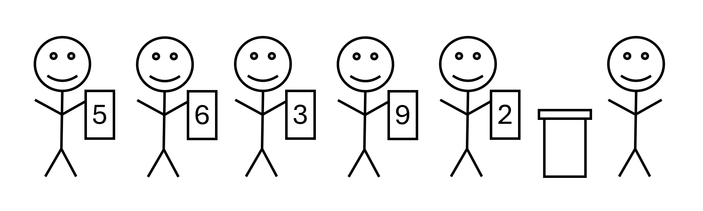

[Return](0-welcome.md)

# Queues

Queues are an ordered set of data that function on the principle of First-In-First-Out, while Python Lists function on the principle of First-In-Last-Out. A list is more like a stack of papers, where it's easiest to take a piece off the top, while a queue operates more like the line at the pharmamcy. People are helped in the order they got in line. The first people getting served first.



The easiest way to implement this in Python is by using two lists paired together, pushing the queue data back and forth between the two to accomplish the operations of adding or removing items.

Either "enqueuing" or "dequeing" items will be more performant. This is due to the nature of needing to shuffle into the proper order when adding or removing it. In this implementation, the extra time is spent when enqueueing data.

## Enqueue

To hold the data in a state ready to be accessed, we need to ensure the data added first always stays at the end of the list. In other word, we need a way to add data to the front of the list. We can accomplish this using two lists.

By pushing the data between lists, we're able to efficiently add data to the front of the main list and leave the oldest data easily accesible at the back of it.

- **Complexity: O(n)**

```python
def enqueue(self, value):
    # Copy the main list (s1) to the secondary list (s2)
    self.s2 = self.s1[:]
    # Clear the main list and add the new value to it
    # Copy the secondary list to the end of the main list
    self.s1 = [value] + self.s2
```

## Dequeue

A queue is useless if we can't get the data back out of it. With the implementation of enqueue provided above, it's rather simple to get the next avaliable piece of data from the queue. Since it's placed at the end of the list, a simple pop operation removes from the queue and returns it for use.

- **Complexity: O(1)**

```python
def dequeue(self):
    return self.s1.pop()
```

## Peek

If we want to see what's next in the queue without removing it, we can perform a peek operation. By accessing the index [-1] of a list, we can access the value stored at the back of the list (which in the case of our queue is the first item), without removing it.

- **Complexity: O(1)**

```python
def peek(self):
    return self.s1[-1]
```

# Example: Simple Class and a Line

The example below is a simple implementation of a queue class. 

```python
class Queue:
    def __init__(self):
        self.s1 = []
        self.s2 = []

    def enqueue(self, value):
        self.s2 = self.s1[:]
        self.s1 = [value] + self.s2

    def dequeue(self):
        return self.s1.pop()

    def peek(self):
        return self.s1[-1]

    def __iter__(self):
        while len(self.s1) > 0:
            yield self.s1.pop()

    def __reversed__(self):
        for z in self.s1:
            yield z

    def __str__(self):
        if len(self.s1) == 0:
            return 'Empty Queue'
        output = 'Queue{'
        first = True
        self.s2 = self.s1
        while len(self.s2) > 0:
            if first:
                first = False
            else:
                output += ', '
            output += str(self.s2.pop())
        output +='}'
        return output  
```

# Problem to Solve:

