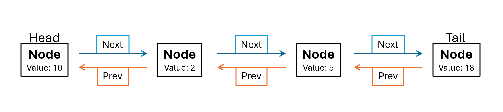

[- Return -](0-welcome.md)

# Linked Lists

Linked list are another form of an ordered data structure, but they store the individual values seperate from each other. They maintain a relationship between the values by storing the value, and the location of the next value. Think of it like a scavenger hunt. Where each clue leads you to where the next clue is hidden.

## Initializing the Class

To access data in the middle of the linked list, you must start from either the first or last value. This first value is commonly refered to as the head, and the last as the tail. We'll create these as class variables and update them to point to the head and tail values as they're created and removed.

```python
def __init__(self):
    self.head = None
    self.tail = None
```

## Nodes

We'll refer to each value in a linked list as a 'node'. For the most basic implementation of a linked list, each node stores only its value or "data" and the location of the next node. Much more common though, is for each node to also store the location of the previous node. This allows the data to be accessed at any point in the chain, and then moved through either forwards or in reverse.



```python
class Node:
    def __init__(self, data):
        self.data = data
        self.next = None
        self.prev = None
```

## Adding Data

When adding data to a linked list, it can be added at the head, tail, or some point in the middle. The functions necessary to perform these operations are similar, but not identical.

### Inserting a Head

```python
def insertHead(self, value):
    new_node = LinkedList.Node(value)
    if self.head is None:
        self.head = new_node
        self.tail = new_node
    else:
        new_node.next = self.head
        self.head.prev = new_node
        self.head = new_node
```

### Inserting a Tail

```python
def insert_tail(self, value):
    new_node = LinkedList.Node(value)
    if self.head is None:
        self.head = new_node
        self.tail = new_node
    else:
        self.tail.next = new_node
        new_node.prev = self.tail
        self.tail = new_node
```

### Inserting in the Middle

To insert data in a linked list, you need to specify where it should go. For this function it places the new node after a specific value stored in the linked list.

-   Complexity: 

```python
def insert_after(self, value, new_value):
    curr = self.head
    while curr is not None:
        if curr.data == value:
            if curr == self.tail:
                self.insert_tail(new_value)
            else:
                new_node = LinkedList.Node(new_value)
                new_node.prev = curr
                new_node.next = curr.next
                curr.next.prev = new_node
                curr.next = new_node
            return
        curr = curr.next
```

## Removing Data

Similar to adding data, when removing data we can choose to remove it from the head, tail, or a specific data in the list.

### Removing the Head

```python
def remove_head(self):
    if self.head == self.tail:
        self.head = None
        self.tail = None
    elif self.head is not None:
        self.head.next.prev = None
        self.head = self.head.next
```

### Removing the Tail

```python
def remove_tail(self):
    if self.head == self.tail:
        self.head = None
        self.tail = None
    elif self.tail is not None:
        self.tail.prev.next = None
        self.tail = self.tail.prev
```

### Removing a Specific Value

```python
def remove(self, value):
    curr = self.head
    while curr is not None:
        if curr.data == value:
            if curr == self.tail:
                self.remove_tail()
            elif curr == self.head:
                self.remove_head()
            else:
                curr.prev.next = curr.next
                curr.next.prev = curr.prev
                curr = None
            return
        curr = curr.next
```

# Example Linked List Class

```python
class LinkedList:

    class Node:
        def __init__(self, data):
            self.data = data
            self.next = None
            self.prev = None

    def __init__(self):
        self.head = None
        self.tail = None

    def insertHead(self, value):
        new_node = LinkedList.Node(value)
        if self.head is None:
            self.head = new_node
            self.tail = new_node
        else:
            new_node.next = self.head
            self.head.prev = new_node
            self.head = new_node

    def insert_tail(self, value):
        new_node = LinkedList.Node(value)
        if self.head is None:
            self.head = new_node
            self.tail = new_node
        else:
            self.tail.next = new_node
            new_node.prev = self.tail
            self.tail = new_node

    def remove_head(self):
        if self.head == self.tail:
            self.head = None
            self.tail = None
        elif self.head is not None:
            self.head.next.prev = None
            self.head = self.head.next

    def remove_tail(self):
        if self.head == self.tail:
            self.head = None
            self.tail = None
        elif self.tail is not None:
            self.tail.prev.next = None
            self.tail = self.tail.prev

    def insert_after(self, value, new_value):
        curr = self.head
        while curr is not None:
            if curr.data == value:
                if curr == self.tail:
                    self.insert_tail(new_value)
                else:
                    new_node = LinkedList.Node(new_value)
                    new_node.prev = curr
                    new_node.next = curr.next
                    curr.next.prev = new_node
                    curr.next = new_node
                return
            curr = curr.next

    def remove(self, value):
        curr = self.head
        while curr is not None:
            if curr.data == value:
                if curr == self.tail:
                    self.remove_tail()
                elif curr == self.head:
                    self.remove_head()
                else:
                    curr.prev.next = curr.next
                    curr.next.prev = curr.prev
                    curr = None
                return
            curr = curr.next

    def replace(self, old_value, new_value):
        curr = self.head
        while curr is not None:
            if curr.data == old_value:
                curr.data = new_value
            if curr == self.tail:
                return
            else:
                curr = curr.next

    def __iter__(self):
        curr = self.head
        while curr is not None:
            yield curr.data
            curr = curr.next

    def __reversed__(self):
        curr = self.tail
        while curr is not None:
            yield curr.data
            curr = curr.prev

    def __str__(self):
        output = "linkedlist["
        first = True
        for value in self:
            if first:
                first = False
            else:
                output += ", "
            output += str(value)
        output += "]"
        return output
```


## Problem

Implement a function named "insert_at_index" that inserts new nodes at a specific index in the linked list. Assume the head is index 0.