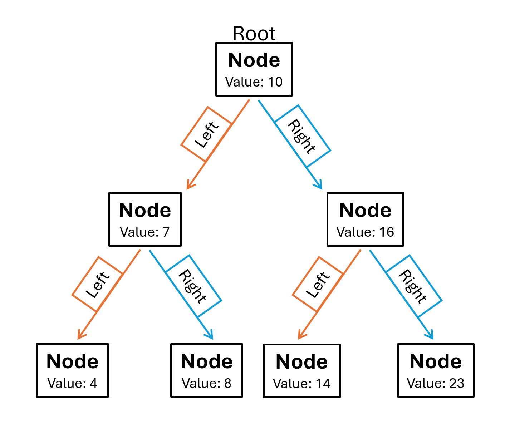

[Return to Main Page](0-welcome.md)

# Trees

Trees are an ordered and sorted data structure. They're similar to a linked list in principle, but rather than a single chain of linked data, it branches. Starting at the first node, or the root, there are two linked nodes. This branching allows the data to be aranged in a way that searches can be performed very efficently. 



## Initializing the Class

When accessing data from a tree, everything starts from the root.

```python
class BST:
    def __init__(self):
        self.root = None
```

From there, the root value is stored in the first node. Each node stores three pieces of data: it's value, a pointer to a 'right' node, and a pointer to a 'left' node.

```python
class Node:
    def __init__(self, data):
        self.data = data
        self.left = None
        self.right = None
```

## Adding Data

If the tree is empty, this first value is added as the root. 

```python
def insert(self, data):
    if self.root is None:
        self.root = BST.Node(data)
    else:
        self._insert(data, self.root)
```

When adding data beyond the root we _could_ randomly decide to add data to the left or right, but that would create a tree with very difficult data to search. It's better to add data by following a set pattern. If we always add data to the right if it's value is greater than the current node, or left if it's less, we create a data structure that can easily be searched.

```python
def _insert(self, data, node):
    if data < node.data:
        if node.left is None:
            node.left = BST.Node(data)
        else:
            self._insert(data, node.left)
    elif data > node.data:
        if node.right is None:
            node.right = BST.Node(data)
        else:
            self._insert(data, node.right)
```

## Searching the Tree

Since data's added to the tree in an orderly manner, we can search it by following the pattern. We'll use a recursive function to follow the branches and decided at each node which direction to go. If the values less than the current node, we'll go left. We'll go right if it's greater. If there's no node in that direction, we'll go the other way. By folowing this pattern we'll find organized data the quickest, but still locate the value if its in the wrong spot.

```python
def __contains__(self, data):
    return self._contains(data, self.root)

def _contains(self, data, node):
    if node.data is not None:
        if node.data == data:
            return True
        elif data < node.data and node.left is not None:
            return self._contains(data, node.left)
        elif data > node.data and node.right is not None:
            return self._contains(data, node.right)
```

# Sample Tree Class

``` python
class BST:

    class Node:

        def __init__(self, data):
            self.data = data
            self.left = None
            self.right = None

    def __init__(self):
        self.root = None

    def insert(self, data):
        if self.root is None:
            self.root = BST.Node(data)
        else:
            self._insert(data, self.root)

    def _insert(self, data, node):
        if data < node.data:
            if node.left is None:
                node.left = BST.Node(data)
            else:
                self._insert(data, node.left)
        elif data > node.data:
            if node.right is None:
                node.right = BST.Node(data)
            else:
                self._insert(data, node.right)

    def __contains__(self, data):
        return self._contains(data, self.root)

    def _contains(self, data, node):
        if node.data is not None:
            if node.data == data:
                return True
            elif data < node.data and node.left is not None:
                return self._contains(data, node.left)
            elif data > node.data and node.right is not None:
                return self._contains(data, node.right)

    def __iter__(self):
        yield from self._traverse_forward(self.root)
        
    def _traverse_forward(self, node):
        if node is not None:
            yield from self._traverse_forward(node.left)
            yield node.data
            yield from self._traverse_forward(node.right)
        
    def __reversed__(self):    
        yield from self._traverse_backward(self.root)

    def _traverse_backward(self, node):
        if node is not None:
            yield from self._traverse_backward(node.right)
            yield node.data
            yield from self._traverse_backward(node.left)

    def get_height(self):
        if self.root is None:
            return 0
        else:
            return self._get_height(self.root)

    def _get_height(self, node):
        if node.right is not None:
            right = (self._get_height(node.right))+1
        else:
            right = 1
        if node.left is not None:
            left = (self._get_height(node.left))+1
        else:
            left = 1
        return max(right,left)
```


# Problem to Solve

Write a function that locates a value in a tree and displays the path from root to value.

Example Output: 1-3-7-12

[Solution](tree-solution.md)